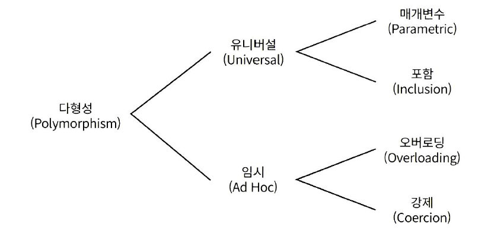
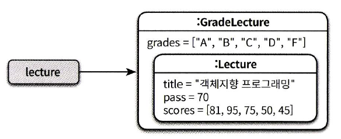
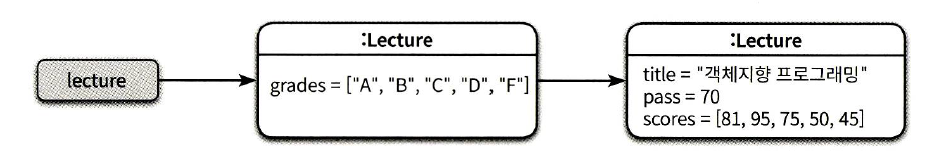
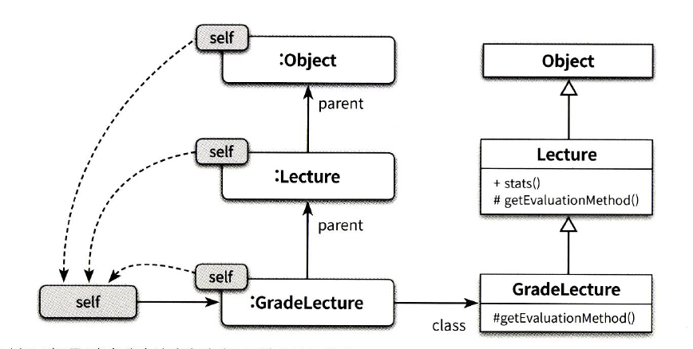

## 12장 다형성

상속의 목적은 코드 재사용이 아니다. **상속은 타입 계층을 구조화하기 위해 사용해야 한다.**

상속은 다형성을 구현할 수 있는 가장 일반적인 방법이다. 

이번 장에서는 상속의 관점에서 다형성이 구현되는 기술적인 메커니즘을 살펴보기로 한다. 


### 다형성

다형성은 여러 타입을 대상으로 동작할 수 있는 코드를 작성할 수 있는 방법이라고 할 수 있다. 

객체지향 프로그래밍에서 사용되는 다형성은 다음과 같이 분류될 수 있다. 




일반적으로 하나의 클래스 안에 동일한 이름의 메서드가 존재하는 경우를 가리켜 **오버로딩 다형성**이라 부른다. 이를 통해 유사한 작업을 수행하는 메서드의 이름을 통일할 수 있다. (시그니처는 서로 다르다.)

**강제 다형성**은 언어가 지원하는 자동적인 타입 변환이나 사용자가 직접 구현한 타입 변환을 이용해 동일한 연산자를 다양한 타입에 사용할 수 있는 방식을 가리킨다. (연산자 오버로딩...?)

**매개변수 다형성**은 제네릭 프로그래밍과 관련이 높은데 클래스의 인스턴스 변수나 메서드의 매개변수 타입을 임의의 타입으로 선언한 후 사용하는 시점에 구체적인 타입으로 지정하는 방식을 가리킨다.

**포함 다형성**은 메시지가 동일하더라도 수신한 객체의 타입에 따라 실제로 수행되는 행동이 달라지는 능력을 의미. 포함 다형성을 서브타입 다형성이라고도 부른다. 객체지향 프로그래밍에서 가장 널리 알려진 형태의 다형성. 

포함 다형성을 구현하는 가장 일반적인 방법은 상속을 사용하는 것. **상속의 진정한 목적은 코드 재사용이 아니라 다형성을 위한 서브타입 계층을 구축하는 것.**

포함 다형성을 위해 상속을 사용하는 가장 큰 이유는 상속이 클래스들을 계층으로 쌓아 올린 후 상황에 따라 적절한 메서드를 선택할 수 있는 메커니즘을 제공하기 때문

**이번 장의 목표는 포함 다형성의 관점에서 런타임에 상속 계층 안에서 적절한 메서드를 선택하는 방법을 이해하는 것.**


### 상속의 양면성

상속을 이용하면 부모 클래스에서 정의한 모든 데이터를 자식 클래스의 인스턴스에 자동으로 포함시킬 수 있다. 이것은 데이터 관점의 상속이다. 

메서드 역시 자동으로 자식 클래스에 포함시킬 수 있다. 이것이 행동 관점의 상속이다. 

상속의 목적은 코드 재사용이 아니다. 상속은 프로그램을 구성하는 개념들을 기반으로 다형성을 가능하게 하는 타입 계층을 구축하기 위한 것이다. 

상속의 메커니즘을 이해하는데 필요한 몇 가지 개념을 살펴보자. 

- 업캐스팅
- 동적 메서드 탐색
- 동적 바인딩
- `self` 참조
- `super` 참조 

부모 클래스와 자식 클래스에 동일한 시그니처를 가진 메서드가 존재할 경우 자식 클래스의 메서드 우선순위가 더 높다. 우선순위가 더 높다는 것은 메시지를 수신했을 때 부모 클래스의 메서드가 아닌 자식 클래스의 메서드가 실행된다는 것을 의미.

**자식 클래스 안에 상속받은 메서드와 동일한 시그니처의 메서드를 재정의해서 부모 클래스의  구현을 새로운 구현으로 대체하는 것을 메서드 오버라이딩이라고 부른다.**

**부모 클래스에서 정의한 메서드와 이름은 동일하지만 시그니처는 다른 메서드를 자식 클래스에 추가하는 것을 메서드 오버로딩이라고 부른다.**


#### 데이터 관점의 상속

상속을 인스턴스 관점에서 바라볼 때는 개념적으로 자식 클래스의 인스턴스 안에 부모 클래스의 인스턴스가 포함되는 것이라고 생각하는 것이 유용하다. 





데이터 관점에서 상속은 자식 클래스의 인스턴스 안에 부모 클래스 인스턴스를 포함하는 것으로 볼 수 있다. 


#### 행동 관점의 상속

행동 관점의 상속은 부모 클래스가 정의한 일부 메서드를 자식 클래스의 메서드로 포함시키는 것을 의미.

부모 클래스의 모든 퍼블릭 메서드는 자식 클래스의 퍼블릭 인터페이스에 포함된다. 외부의 객체가 부모 클래스의 인스턴스에게 전송할 수 있는 모든 메시지는 자식 클래스의 인스턴스에게도 전송할 수 있다. 

어떻게 부모 클래스에서 구현한 메서드를 자식 클래스의 인스턴스에서 수행할 수 있는 것일까? 그 이유는 런타임에 시스템이 **자식 클래스에 정의되지 않은 메서드가 있을 경우 이 메서드를 부모 클래스 안에서 탐색하기 때문** 

**행동 관점에서 상속과 다형성의 기본적인 개념을 이해하기 위해서는 상속 관계로 연결된 클래스 사이의 메서드 탐색 과정을 이해하는 것이 중요하다.** 

객체의 경우에는 서로 다른 상태를 저장할 수 있도록 각 인스턴스별로 독립적인 메모를 할당받아야 한다. 하지만 **메서드의 경우에는 동일한 클래스의 인스턴스끼리 공유**가 가능하기 때문에 클래스는 **한 번만 메모리에 로드**하고 각 **인스턴스별로 클래스를 가리키는 포인터를 갖게 하는 것이 경제적**.

자식 클래스의 인스턴스를 통해 부모 클래스에 정의된 메서드를 실행하는 절차.

1. 메시지를 수신한 객체는 `class` 포인터로 연결된 자신의 클래스에서 적절한 메서드가 존재하는지를 탐색
2. 메서드가 자신의 클래스에 존재하지 않으면 클래스의 `parent` 포인터를 따라 부모 클래스를 차례대로 훑어가면서 적절한 메서드가 존재하는지 탐색 

**각 객체에 포함된 `class` 포인터와 클래스에 포함된 `parent` 포인터를 조합하면 현재 인스턴스의 클래스에서 최상위 부모 클래스에 이르기까지 모든 부모 클래스에 접근하는 것이 가능.**


### 업캐스팅과 동적 바인딩

코드 안에서 선언된 참조 타입과 무관하게 실제로 메시지를 수신하는 객체의 타입에 따라 실행되는 메서드가 달라질 수 있는 것은 업캐스팅과 동적 바인딩이라는 메커니즈이 작용하기 때문

- 부모 클래스 타입으로 선언된 변수에 자식 클래스의 인스턴스를 할당하는 것이 가능하다. 이를 업캐스팅이라고 부른다. 
- 선언된 변수의 타입이 아니라 메시지를 수신하는 객체의 타입에 따라 실행되는 메서드가 결정된다. 메시지를 처리할 적절한 메서드를 컴파일 시점이 아니라 실행 시점에 결정하기 때문에 가능. 이를 동적 바인딩이라고 부른다.

업캐스팅은 서로 다른 클래스의 인스턴스를 동일한 타입에 할당하는 것을 가능하게 해준다. 따라서 부모 클래스에 대해 작성된 코드를 전혀 수정하지 않고도 자식 클래스에 적용할 수 있다. 

동적 메서드 탐색은 부모 클래스의 타입에 대해 메시지를 전송하더라도 실행 시에는 실제 클래스를 기반으로 실행될 메서드가 선택되게 해준다. 따라서 코드를 변경하지 않고도 실행되는 메서드를 변경할 수 있다. 

> **개방-폐쇄 원칙과 의존성 역전 법칙**
>
> 업캐스팅과 동적 메서드 탐색은 코드를 변경하지 않고도 기능을 추가할 수 있게 해주며 이것은 개방-폐쇄 원칙의 의도와도 일치한다. 
>
> 업캐스팅과 동적 메서드 탐색은 메커니즘. 개방-폐쇄 원칙과 의존성 역전 법칙를 따른다고 보기 힘든 것이 이들의 중심에는 추상화가 위치하고 있다.


#### 업캐스팅

컴파일러의 관점에서 자식 클래스는 아무런 제약 없이 부모 클래스를 대체할 수 있기 때문에 부모 클래스와 협력하는 클라이언트는 다양한 자식 클래스의 인스턴스와도 협력하는 것이 가능. 


#### 동적 바인딩

객체지향 언어에서 메서드를 실행하는 방법은 메시지를 전송하는 것. 

전통적인 언어들은 호출될 함수를 컴파일 타임에 결정한다. 다시 말해 코드를 작성하는 시점에 호출될 코드가 결정된다. 이처럼 **컴파일 타임에 호출할 함수를 결정하는 방식을 정적 바인딩, 초기 바인딩 또는 컴파일 타임 바인딩이라고 부른다.**

**실행될 메서드를 런타임에 결정하는 방식을 동적 바인딩 또는 지연 바인딩이라고 부른다.**

객체지향 언어가 제공하는 업캐스팅과 동적 바인딩을 이용하면 부모 클래스 참조에 대한 메시지 전송을 자식 클래스에 대한 메서드 호출로 변한할 수 있다.


### 동적 메서드 탐색과 다형성

객체지향 시스템은 다음 규칙에 따라 실행할 메서드를 선택한다.

- 메시지를 수신한 객체는 먼저 자신을 생성한 클래스에 적합한 메서드가 존재하는지 검사. 존재하면 메서드를 실행하고 탐색을 종료
- 메서드를 찾지 못했다면 부모 클래스에서 메서드 탐색을 계속한다. 이 과정은 적합한 메서드를 찾을 때까지 상속 계층을 따라 올라가며 계속 된다. 
- 상속 계층의 가장 최상위 클래스에 이르렀지만 메서드를 발견하지 못한 경우 예외를 발생시키며 탐색을 중단. 

메시지 탐색과 관련해서 이해해야 하는 중요한 변수 :  **`self` 참조**

객체가 메시지를 수신하면 컴파일러는 `self` 참조라는 임시 변수를 자동으로 생성한 후 메시지를 수신한 객체를 가리키도록 설정. 동적 메서드 탐색은 `self`가 가리키는 객체의 클래스에서 시작해서 상속 계층 역방향으로 이뤄지며 메서드 탐색이 종료되는 순간 `self` 참조는 자동으로 소멸 

메서드 탐색은 자식 클래스에서 부모 클래스의 방형으로 진행. 항상 자식 클래스의 메서드가 부모 클래스의 메서드보다 먼저 탐색되기 때문에 자식 클래스에 선언된 메서드가 부모 클래스의 메서드보다 더 높은 우선순위를 가지게 된다. 

*메서드 탐색의 두 가지 원리* 

- **자동적인 메시지 위임**
  - 자식 클래스는 자신이 이해할 수 없는 메시지를 전송받은 경우 상속 계층을 따라 부모 클래스에게 처리를 위임
- **동적인 문맥을 사용** 
  - 메시지를 수신했을 때 실제로 어떤 메서드를 실행할지를 결정하는 것은 컴파일 시점이 아닌 실행 시점에 이뤄지며, 메서드를 탐색하는 경로는 `self` 참조를 이용해서 결정. 

객체의 타입에 따라 메서드를 탐색하는 문맥이 동적으로 결정, 여기서 가장 중요한 역할이 `self` 참조. 


#### 자동적인 메시지 위임

상속 계층 안의 클래스는 메시지를 처리할 방법을 알지 못할 경우 메시지에 대한 처리를 부모 클래스에게 위임한다. 

**핵심은 적절한 메서드를 찾을 때까지 상속 계층을 따라 부모 클래스로 처리가 위임된다는 것이다.**

이런 관점에서 상속 계층을 정의하는 것은 메서드 탐색 경로를 정의한느 것과 동일하다. 스위프트의 프로토콜과 확장 메커니즘은 상속 계층에 독립적으로 메시지를 위임할 수 있는 대표적인 장치다. 

메서드 오버라이딩은 자식 클래스의 메서드가 동일한 시그니처를 가진 부모 클래스의 메서드보다 먼저 탐색되기 때문에 벌어지는 현상이다. 

자식 클래스가 부모 클래스의 메서드를 오버라이딩하면 자식 클래스에서 부모 클래스로 향하는 메서드 탐색 순서 때문에 자식 클래스의 메서드가 부모 클래스의 메서드를 감추게 된다. 

C++는 부모 클래스에 선언된 이름이 동일한 메서드 전체를 숨겨서 클라이언트가 호출하지 못하도록 막는다. 이를 이름 숨기기라고 부른다. 

**즉 요점은 동적 메서드 탐색과 관련된 규칙이 언어마다 다를 수 있다는 점이다.**


#### 동적인 문맥

여기서 중요한 것은 메시지를 수신한 객체가 무엇이냐에 따라 메서드 탐색을 위한 문맥이 동적으로 바뀐다는 것이다. 이 동적인 문맥을 결정하는 것은 바로 메시지를 수신한 객체를 가리키는 `self` 참조다. 

동일한 코드라고 하더라도 `self` 참조가 가리키는 객체가 무엇인지에 따라 메서드 탐색을 위한 상속 계층의 범위가 동적으로 변한다. 

```java
public class Lecture { 
  public String stats() { 
  	return String.format("Title: %s, Evaluation Method : %s", title, getEvaluationMethod());
  }
  
  public String getEvaluationMethod() { 
  	return "Pass or Fail";
  }
}
```

`getEvaluationMethod()`라는 구문은 현재 클래스의 메서드를 호출하는 것이 아니라 현재 객체에게 `getEvaluationMethod()` 메시지를 전송하는 것이다.  현재 객체에게 메시지를 전송하는 것이다. 

그렇다면 현재 객체란 무엇인가? 바로 `self` 참조가 가리키는 객체다. 

`self`가 참조하는 현재 객체에게 메시지를 전송하라는 의미다. 메서드 탐색은 처음에 메시지 탐색을 시작했던 `self` 참조가 가리키는 바로 그 클래스에서부터 다시 시작한다는 것이다. 

`self` 전송이 깊은 상속 계층과 계층 중간중간에 함정처럼 숨겨져 있는 메서드 오버라이딩과 만나면 극단적으로 이해하기 어려운 코드가 만들어진다. 


#### 이해할 수 없는 메시지

이해할 수 없는 메시지를 처리하는 방법은 프로그래밍 언어가 정적 타입 언어에 속하는지, 동적 타입 언어에 속하는지에 따라 달라진다.

**정적 타입 언어와 이해할 수 없는 메시지**

정적 타입 언어에서는 코드를 컴파일할 때 상속 계층 안의 클래스들이 메시지를 이해할 수 있는지 여부를 판단한다. 따라서 상속 계층 전체를 탐색한 후에도 메시지를 처리할 수 있는 메서드를 발견하지 못했다면 컴파일 에러를 발생시킨다. 


**동적 타입 언어와 이해할 수 없는 메시지**

동적 타입 언어네는 컴파일 단계가 존재하지 않기 때문에 실제로 코드를 실행해보기 전에는 메시지 처리 기능 여부를 판단할 수 없다. 

하지만 동적 타입 언어에서는 이해할 수 없는 메시지에 대해 예외를 던지는 것 외에도 선택할 수 있는 방법이 하나 더 있다. 메시지를 이해할 수 없다는 메시지에 응답할 수 있는 메서드를 구현하는 것이다. 이 경우 객체는 자신의 인터페이스에 정의되지 않은 메시지를 처리하는 것이 가능해진다. 

단지 객체가 메시지를 처리할 수 있다고 믿고 메시지를 전송할 뿐

메시지 전송자는 자신이 원하는 메시지를 전송하고 메시지 수신자는 스스로의 판단에 따라 메시지를 처리한다. 이것은 메시지를 기반으로 협력하는 자율적인 객체라는 순수한 객체지향의 이상에 좀 더 다까운 것이다. 그러나 동적 타입 언어의 이러한 동적인 특성과 유연성은 코드를 이해하고 수정하기 어렵게 만들뿐만 아니라 디버깅 과정을 복잡하게 만들기도 한다. 

정적 타입 언어에는 이런 유연성이 부족하지만 좀 더 안정적이다. 모든 메시지는 컴파일 타임에 확인되고 이해할 수 없는 메시지는 컴파일 에러로 이어진다. 

이해할 수없는 메시지를 처리할 수 있는 유연성은 잃게 되지만 실해 시점에 오류가 발생할 가능성을 줄임으로써 프로그램이 좀 더 안정적으로 실행될 수 있는 것이다. 


#### self 대 super

`self` 참조의 가장 큰 특징은 동적이라는 점이다.

`super`에 의해 호출되는 메서드는 부모 클래스의 메서드가 아니라 더 상위에 위치한 조상 클래스의 메서드일 수도 있다. 

`super` 전송은 부모 클래스에서부터 메서드 탐색을 시작하게 된다. 

`super` 참조의 정확한 의도는 '지금 이 클래스의 부모 클래스에서부터 메서드 탐색을 시작하세요.'다.

이처럼 `super` 참조를 통해 메시지를 전송하는 것은 마치 부모 클래스의 인스턴스에게 메시지를 전송하는 것 처럼 보이기 때문에 이를 `super` 전송이라고 부른다. 

> **`super` 전송과 동적 바인딩**
>
> 사용하는 언어의 특성에 따라 컴파일 시점이 아닌 실행 시점에 `super`의 대상이 결정될 수도 있다는 점을 기억하라.


### 상속 대 위임

지금까지 살펴본 것처럼 다형성은 `self` 참조가 가리키는 현재 객체에게 메시지를 전달하는 특성을 기반으로 한다. 


#### 위임과 self 참조

메서드 탐색 중에는 자식 클래스의 인스턴스와 부모 클래스의 인스턴스가 동일한 `self` 참조를 공유하는 것으로 봐도 무방하다. 



> **포워딩과 위임**
>
> `self` 참조를 전달하지 않는 경우를 포워딩이라고 부른다. 이와 달리 `self` 참조를 전달하는 경우에는 위임이라고 부른다. 

`self` 참조의 전달은 결과적으로 자식 클래스의 인스턴스와 부모 클래스의 인스턴스 사이에 동일한 실행 문맥을 공유할 수 있게 해준다. 

상속은 동적으로 메서드를 탐색하기 위해 현재의 실행 문맥을 가지고 있는 `self` 참조를 전달한다. 그리고 이 객체들 사이에서 메시지를 전달하는 과정은 자동으로 이뤄진다. 따라서 자동적인 메시지 위임이라고 부르는 것이다. 


#### 프로토타입 기반의 객체지향 언어

사실 클래스가 존재하지 않고 오직 객체만 존재하는 프로토타입 기반의 객체지향 언어에서 상속을 구현하는 유일한 방법은 객체 사이의 위임을 이용하는 것이다. 

메시지를 전송하면 `prototype`으로 연결된 객체 사이의 경로를 통해 객체 사이의 메서드 탐색이 자동으로 이뤄진다. 

메서드를 탐색하는 과정은 클래스 기반 언어의 상속과 거의 동일하다. 단지 정적인 클래스 간의 관계가 아니라 동적인 객체 사이의 위임을 통해 상속을 구현하고 있을 뿐이다. 자바스크립트는 `prototype`으로 연결된 객체들의 체인을 거슬러 올라가며 자동적으로 메시지에 대한 위임을 처리한다. 

이것은 객체지향 패러다임에서 클래스가 필수 요소가 아니라는 점을 잘 보여준다.  또한 상속 이외의 방법으로도 다형성을 구현할 수 있다는 사실 역시 잘 보여준다. 

중요한 것은 메시지와의 협력이다. 

